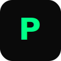

<div align="center">
  
  <h1>✨ Pixel Studio</h1>
  <p><i>Premium Creative Agency Website with Stunning Animations</i></p>

  
  
  
  
  
  

  
  

  <br/>

  [](https://pixel-studio-demo.vercel.app)
  [](#-getting-started)

</div>

---

## 🎬 Demo

<div align="center">
  
  <p><i>Full website walkthrough</i></p>
</div>

---

## ✨ Features

### 🎨 Design & UI
- **Premium Dark Theme** — Elegant black/white base with neon green (#00ff88) accent
- **Large Typography** — Bold, impactful headlines with custom fonts
- **Asymmetric Layouts** — Modern, dynamic section compositions
- **Grain Texture Overlay** — Subtle texture for depth and character

### ⚡ Animations & Effects
- **Smooth Page Transitions** — Framer Motion powered transitions
- **Scroll-Triggered Animations** — GSAP ScrollTrigger for reveal effects
- **Horizontal Scroll Gallery** — Pinned horizontal scrolling for portfolio
- **Animated Statistics** — Count-up numbers on scroll
- **Staggered Text Reveal** — Letter-by-letter text animations
- **Floating Elements** — Subtle parallax and float effects

### 📱 Responsive Design
- **Mobile-First Approach** — Optimized for all screen sizes
- **Touch-Friendly** — Swipe gestures and touch interactions
- **Adaptive Navigation** — Hamburger menu on all devices

### 🛠️ Technical
- **TypeScript** — Full type safety
- **Component-Based** — Modular, reusable components
- **Performance Optimized** — Lazy loading and code splitting
- **SEO Ready** — Semantic HTML structure

---

## 🛠️ Tech Stack

<div align="center">

### Frontend

| Technology | Description |
|:---:|:---|
|  | UI Component Library |
|  | Type-Safe JavaScript |
|  | Utility-First CSS |
|  | Animation Library |
|  | Advanced Animations |

### Tools & Build

| Technology | Description |
|:---:|:---|
|  | Next-Gen Build Tool |
|  | Code Linting |
|  | CSS Processing |

</div>

---

## 🚀 Getting Started

### Prerequisites

- **Node.js** 18.0 or higher
- **npm** or **yarn** package manager

### Installation

1. **Clone the repository**
   ```bash
   git clone https://github.com/yourusername/pixel-studio.git
   ```

2. **Navigate to project directory**
   ```bash
   cd pixel-studio
   ```

3. **Install dependencies**
   ```bash
   npm install
   ```

4. **Start development server**
   ```bash
   npm run dev
   ```

5. **Open in browser**
   ```
   http://localhost:5173
   ```

### Available Scripts

| Command | Description |
|---------|-------------|
| `npm run dev` | Start development server |
| `npm run build` | Build for production |
| `npm run preview` | Preview production build |
| `npm run lint` | Run ESLint |

---

## 📁 Project Structure

```
pixel-studio/
├── 📂 public/
│   └── favicon.svg
├── 📂 src/
│   ├── 📂 components/
│   │   ├── About.tsx          # About section with stats
│   │   ├── Awards.tsx         # Awards marquee section
│   │   ├── Contact.tsx        # Contact form section
│   │   ├── CustomCursor.tsx   # Custom cursor component
│   │   ├── FeaturedWork.tsx   # Horizontal scroll gallery
│   │   ├── Footer.tsx         # Site footer
│   │   ├── Hero.tsx           # Hero section
│   │   ├── Loader.tsx         # Loading screen
│   │   ├── Navigation.tsx     # Navigation & menu
│   │   ├── Process.tsx        # Process timeline
│   │   ├── Services.tsx       # Services grid
│   │   ├── Team.tsx           # Team members grid
│   │   └── Testimonials.tsx   # Testimonials slider
│   ├── App.tsx                # Main app component
│   ├── index.css              # Global styles
│   └── main.tsx               # Entry point
├── 📂 screenshots/            # Project screenshots
├── index.html
├── package.json
├── tailwind.config.js
├── tsconfig.json
└── vite.config.ts
```

---

## 🎯 Sections Overview

| Section | Description |
|---------|-------------|
| **Loader** | Animated loading screen with progress counter |
| **Hero** | Large typography with animated elements |
| **Featured Work** | Horizontal scroll portfolio gallery |
| **Services** | Grid of services with hover effects |
| **About** | Split layout with animated counters |
| **Team** | Team members with social links |
| **Process** | 4-step timeline with scroll animation |
| **Testimonials** | Client quotes slider |
| **Awards** | Infinite marquee scroll |
| **Contact** | Form with validation |
| **Footer** | Navigation and social links |

---

## 🗺️ Roadmap

- [x] Initial release
- [x] Responsive design
- [x] Smooth animations
- [x] Loading screen
- [ ] Dark/Light mode toggle
- [ ] Multi-language support (i18n)
- [ ] Blog section
- [ ] CMS integration
- [ ] Performance optimization

---

## 🤝 Contributing

Contributions are welcome! Please follow these steps:

1. **Fork** the project
2. **Create** your feature branch
   ```bash
   git checkout -b feature/AmazingFeature
   ```
3. **Commit** your changes
   ```bash
   git commit -m 'Add some AmazingFeature'
   ```
4. **Push** to the branch
   ```bash
   git push origin feature/AmazingFeature
   ```
5. **Open** a Pull Request

---

## 📄 License

This project is licensed under the **MIT License** — see the [LICENSE](LICENSE) file for details.

---

## 📫 Contact

<div align="center">

**Pixel Studio** — Premium Creative Agency

[](https://pixelstudio.com)
[](mailto:hello@pixelstudio.com)
[](https://linkedin.com)
[](https://twitter.com)
[](https://dribbble.com)

</div>

---

<div align="center">
  <p>Made with 💚 and lots of ☕</p>
  <p><b>⭐ Star this repo if you like it!</b></p>
</div>
